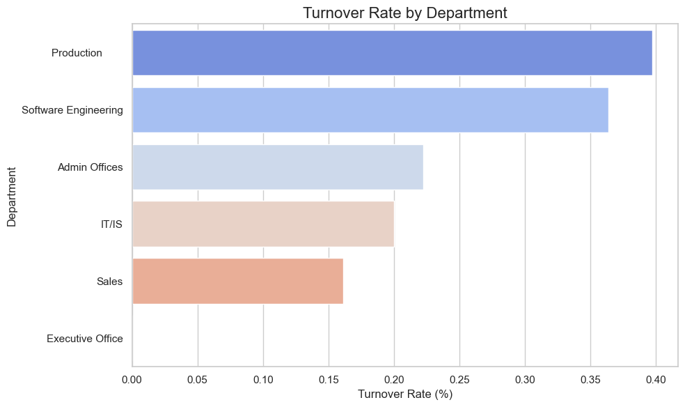
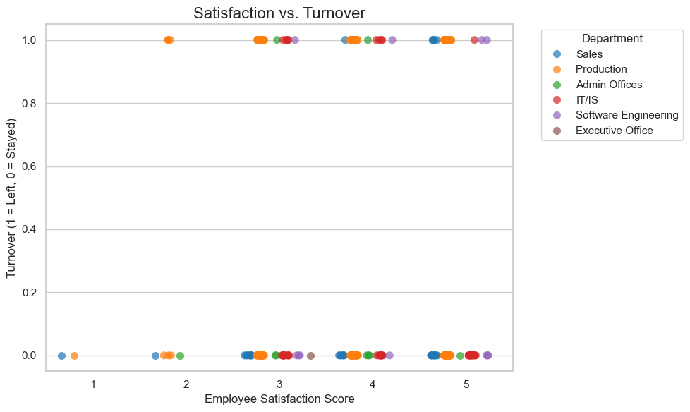
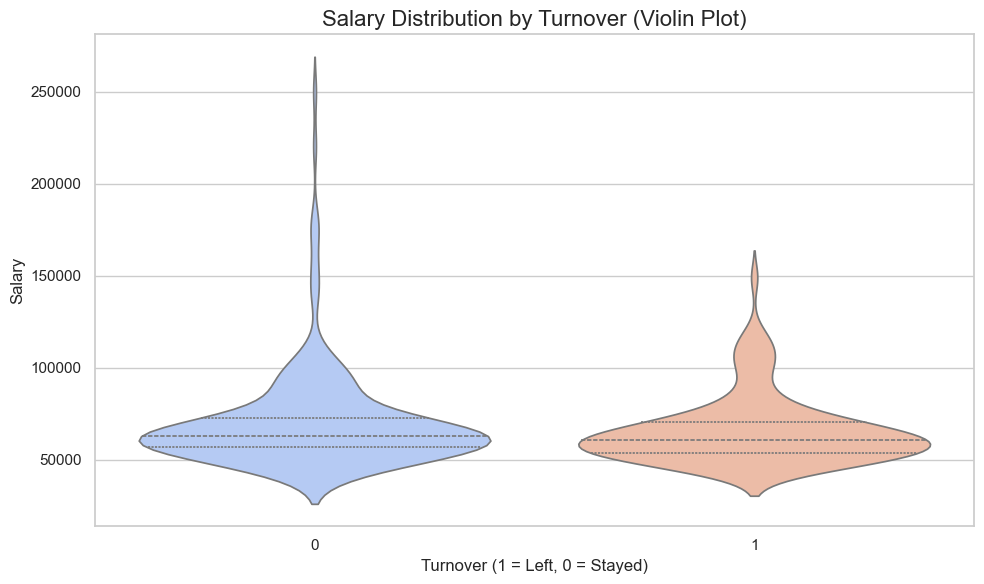
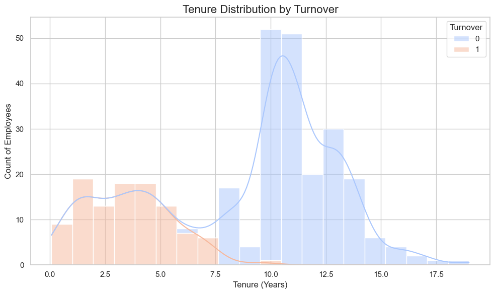

# People Analytics | Employee Turnover Analysis: Insights to Drive Retention

## 1. Understand the Dataset

This project uses an HR dataset from Kaggle containing 311 employee records with 36 features, including demographic, employment, compensation, and performance metrics. 

Key fields:

- Demographics: Sex, RaceDesc, MaritalDesc.
- Employment Details: Department, Position, Salary, DateofHire, DateofTermination.
- Performance Metrics: PerformanceScore, EmpSatisfaction, EngagementSurvey.
- Other Factors: DaysLateLast30, SpecialProjectsCount, Absences.

### Business Challenges Addressed:

- Employee Turnover Analysis: Identifying factors contributing to attrition.
- Retention Strategies: Suggesting data-driven interventions to improve retention.
- Compensation Equity: Exploring the relationship between pay and turnover.

## 2. Define the Business Problem

### Key Business Question:

**"What factors drive employee turnover, and how can the organization reduce attrition while maintaining employee satisfaction and performance?"**

This analysis aims to:

- Highlight turnover hotspots across departments, satisfaction levels, tenure, and salaries.
- Provide actionable recommendations to improve retention rates.

## 3. Data Exploration and Cleaning

### Steps Taken:

1. Data Cleaning:

- Converted DateofHire, DateofTermination, and DOB to datetime format.
- Engineered new features:
  - TenureYears: Employee tenure in years, rounded to 2 decimal places.
  - Turnover: (1 = Left, 0 = Stayed).

2. Exploratory Data Analysis (EDA):

- Analyzed key statistics and distributions for tenure, satisfaction, salary, and turnover.
- Identified patterns and potential outliers in the dataset.

## 4. Analysis

### Methodology:

- Descriptive Statistics:
  - Calculated turnover rates by department, satisfaction scores, tenure, and salary.

- Visualization:
  - Used Python visualizations (e.g., bar charts, scatterplots, violin plots, histograms) to uncover key patterns.

- Feature Engineering:
  - Created features like tenure and turnover for deeper insights.

### Connection to the Business:

Findings from the analysis were framed to support decision-making on retention strategies and workforce engagement.

## 5. Visualizations and Insights

### 1. Turnover Rate by Department

**Findings:**

- Production has the highest turnover rate, followed by Software Engineering and Admin Offices.
- Departments such as Sales, IT/IS, and Executive Office have lower turnover rates.

**Recommendations:**

- Investigate factors contributing to high turnover in Production, such as workload or limited career progression.
- Implement targeted engagement initiatives in high-turnover departments.
- Analyze and replicate successful practices from low-turnover departments.

### 2. Satisfaction vs. Turnover

**Findings:**

As expected, employees with higher satisfaction scores (4 and 5) are more likely to stay and 3mployees with lower satisfaction scores (1 and 2) are more likely to leave.

**Recommendations:**

- Address dissatisfaction among employees with low satisfaction scores through feedback and engagement programs.
- Conduct satisfaction surveys regularly to identify and mitigate risks early.

### 3. Salary Distribution by Turnover

**Findings:**

- Employees who stayed tend to have slightly higher median salaries compared to those who left.
- Employees in lower salary ranges (~$50,000) are more likely to leave.

**Recommendations:**

- Adjust salary structures to ensure pay equity and competitiveness.
- Introduce retention bonuses or performance-based incentives for at-risk employees.
- Regularly benchmark salaries against industry standards to maintain competitiveness.

### 4. Tenure Distribution by Turnover

**Findings:**

- Employees with less than 5 years of tenure are at significantly higher risk of leaving.
- Employees who stay beyond 10 years are much less likely to leave.

**Recommendations:**

- Strengthen onboarding programs to support new hires.
- Introduce milestone-based rewards (e.g., bonuses at 1, 3, and 5 years).
- Conduct regular check-ins with employees in their early tenure to address concerns.

## 6. Recommendations

Based on the findings:

**Retention Programs:**

- Focus retention efforts on high-turnover departments such as Production and Admin Offices.
- Address pain points for employees with low satisfaction and salaries.

**Onboarding and Early Tenure Support:**

- Strengthen onboarding programs and provide mentoring to new hires.
- Offer rewards for key milestones to encourage retention.

**Compensation Review:**

- Ensure salaries are competitive and equitable across roles and departments.
- Introduce performance-based bonuses to retain high performers.

**Monitor Key Metrics:**

Conduct regular satisfaction surveys and track tenure-related trends to anticipate turnover risks.

## 7. Documentation

### Deliverables:

**Code and Analysis:**

- A fully documented Jupyter Notebook covering data cleaning, analysis, and visualizations.

**Visualizations:**

- Key insights visualized using Python, saved as PNGs for easy inclusion in presentations or reports.

**Dataset:**

- Raw and cleaned dataset files.

**Report:**

- This README serves as a summary of the project, including methodology, findings, and recommendations.

## How to Use

1. Clone the Repository:

- git clone <repository_url>

2. Open the Jupyter Notebook:

- Follow the step-by-step code to reproduce the analysis.

3. Explore Visualizations:

- Check the `Visualizations` folder for PNG files of all insights.

4. Examine the Data:

- Use `cleaned_hr_data.csv` for your own analysis.

## Technologies Used

- Programming: Python (Pandas, Matplotlib, Seaborn)
- Data Visualization: Python plots for detailed exploratory analysis
- Dataset: HR dataset from a CSV file
